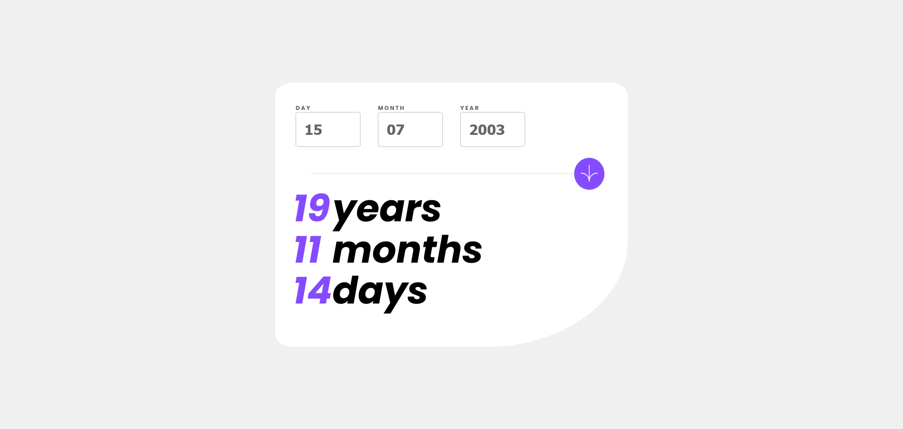

# Frontend Mentor - Age calculator app solution

This is a solution to the [Age calculator app challenge on Frontend Mentor](https://www.frontendmentor.io/challenges/age-calculator-app-dF9DFFpj-Q). Frontend Mentor challenges help you improve your coding skills by building realistic projects. 

## Table of contents

- [Overview](#overview)
  - [The challenge](#the-challenge)
  - [Screenshot](#screenshot)
  - [Links](#links)
- [My process](#my-process)
  - [Built with](#built-with)
  - [What I learned](#what-i-learned)
- [Author](#author)

## Overview

### The challenge

Users should be able to:

- View an age in years, months, and days after submitting a valid date through the form
- Receive validation errors if:
  - Any field is empty when the form is submitted
  - The day number is not between 1-31
  - The month number is not between 1-12
  - The year is in the future
  - The date is invalid e.g. 31/04/1991 (there are 30 days in April)
- View the optimal layout for the interface depending on their device's screen size
- See hover and focus states for all interactive elements on the page

### Screenshot



### Links

- Solution URL: [(https://your-solution-url.com](https://github.com/selinkabil/age-calculator/blob/main/index.html))
- Live Site: (https://selinkabil.github.io/age-calculator/)

## My process

### Built with

- Semantic HTML5 markup
- CSS custom properties
- Flexbox
- CSS Grid

### What I learned

-Basic Javascript Form validation
-Javascript Time and Date Manipulation
-Using the :focus selector


```js
if (days.value == 0) {
          errorMessage(0, "This field is required");
        } else {
          warnings[0].style.display = "none";
        }
```

```js
var secondsInYear = 365.25 * 24 * 60 * 60; 
var years = Math.floor(timeDiff / (1000 * secondsInYear));
```

```css

input:focus {
  outline: 1px solid var(--purple);
}
```


## Author

- Github - [Selin Kabil](https://github.com/selinkabil)
- Frontend Mentor - [@selinkabil](https://www.frontendmentor.io/profile/selinkabil)


